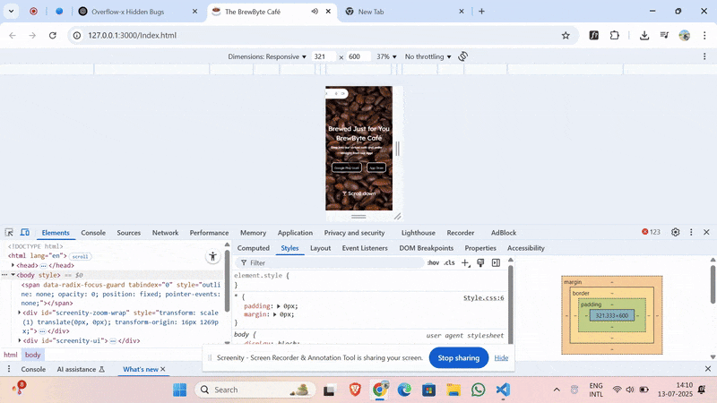

# ☕ BrewByte Café

Welcome to **BrewByte Café** — A Responsive (Width-Focused), animated coffee ordering experience built using **HTML, CSS, and JavaScript**. This project is a creative simulation of a real café ordering system, complete with background music, animated coffee cups, responsive layout, and a fun interactive design.

---

##  Features

-  **Background Video** – Plays on the landing page to set the mood.

-  **Cafe-style Background Music** – *Triggers at just the right moment* 😉

-  **Interactive Coffee Cups** – Click to place your order!  

-  **Responsive Design** – Scales beautifully from **320px to 1440px** width.

-  **Optimized for Devices** –  While the layout was optimized for a target height of **600px**, some height-specific scenarios may show slight visual quirks — something learned and noted during post-build testing.

-  **Custom Animations** – Hover effects, transitions, and more.

-  **Dynamic Coffee Orders** – Simulated using Promises and `async/await`.

-  **Anchor Links** – Mimics navigation to pages like "App Store" or "About".

-  **Pure JavaScript** – Drives order confirmation, preparation, and supports **multiple coffee cups**.

-  **Personal Developer Signature** – A unique touch displayed proudly at the bottom.  

---

##  Demo 

> 🔗 
---

##  Technologies Used

- HTML5
- CSS3 (Media Queries, Animations, Transitions, design)
- JavaScript (Vanilla JS, Promises, DOM Manipulation)

---

#  Live Demo

 Visit the live site here:  
👉 [https://abhijeet2409.github.io/brewbyte-cafe/](https://abhijeet2409.github.io/brewbyte-cafe/)

---

##  Author

**Abhijeet Saharan**  
🔗 [GitHub](https://github.com/Abhijeet2409) • [LinkedIn](https://www.linkedin.com/in/abhijeet-saharan-02ab37312/)
⚡Proudly Signed at the end of the experience. 
   
---

##  Developer Note

> I started this project as a fun side-build. The core idea behind this café simulation gradually took shape as I solved JavaScript problems.

> I added animations, async flows, interactivity, and even simulated an entire order system — all using vanilla JS.

> This was also my first serious attempt at responsive design — and while I now realize my approach could be improved, I’m proud of the effort and what I learned.

> From the initial order to the final coffee being served — everything you see is the result of consistent effort, late-night bug hunts, and a lot of passion.

> I hope you enjoy this café experience as much as I enjoyed building it! ☕

---

