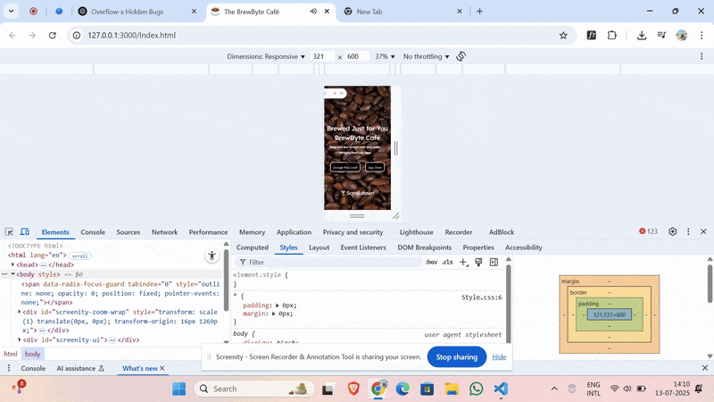

# ☕ BrewByte Café

Welcome to **BrewByte Café** — a fully responsive, animated coffee ordering experience built using **HTML, CSS, and JavaScript**. This project is a creative simulation of a real café ordering system, complete with background music, animated coffee cups, responsive layout, and a fun interactive design.

---


## 🚀 Features

- 🎥 **Background Video** – Plays on the landing page to set the mood.

- 🎵 **Cafe-style Background Music** – *Triggers at just the right moment* 😉

- 🖱️ **Interactive Coffee Cups** – Click to place your order!  

- 📱 **Responsive Design** – Scales beautifully from **320px to 1440px** width.

- 💻 **Optimized for Devices** – Target height set at **600px**, with additional media queries for taller screens. The layout is stable
     across most devices, though minor bugs may still exist. 

- ✨ **Custom Animations** – Hover effects, transitions, and more.

- 🔄 **Dynamic Coffee Orders** – Simulated using Promises and `async/await`.

- 🧭 **Anchor Links** – Mimics navigation to pages like "App Store" or "About".

- 🧠 **Pure JavaScript** – Drives order confirmation, preparation, and supports multiple coffee types.

- ⚡ **Personal Developer Signature** – A unique touch displayed proudly at the bottom.  


---

## 📸 Demo 

> 🔗 
---

## 🛠️ Technologies Used

- HTML5
- CSS3 (Media Queries, Animations, Transitions, design)
- JavaScript (Vanilla JS, Promises, DOM Manipulation)

---

## 📂 How to Run Locally

1. Clone or download this repository.
2. Open the `Index.html` file in your browser.

```bash
git clone https://github.com/Abhijeet2409/brewbyte-cafe.git
cd brewbyte-cafe
open Index.html  # or double-click to open in browser
```

---

## 🙋‍♂️ Author

**Abhijeet Saharan**  
🔗 [GitHub](https://github.com/Abhijeet2409) • [LinkedIn](https://www.linkedin.com/in/abhijeet-saharan-02ab37312/)
⚡ Personal Signature: `⚡💥` proudly displayed at the end of the site . 

   
---

## 📝 License

This project is licensed under the MIT License. Feel free to use and modify for learning or personal projects.

---

## ✨ Developer Note

> I started this project as a fun side-build. The core idea behind this café simulation gradually took shape as I solved JavaScript problems.

> I added animations, async flows, interactivity, and even simulated an entire order system — all using vanilla JS.

> This was also my first serious attempt at responsive design — and while I now realize my approach could be improved, I’m proud of the effort and what I learned.

> From the initial order to the final coffee being served — everything you see is the result of consistent effort, late-night bug hunts, and a lot of passion.

> I hope you enjoy this café experience as much as I enjoyed building it! ☕


---

